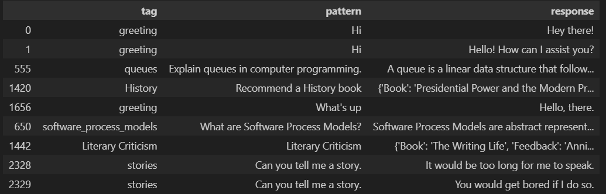
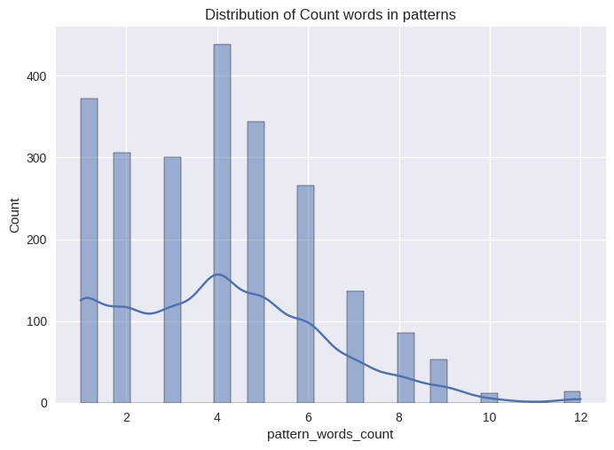
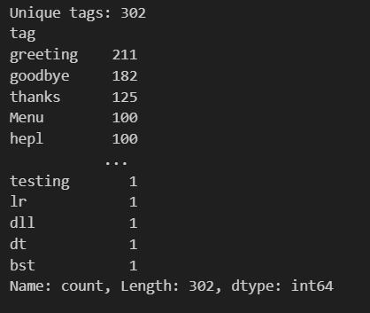
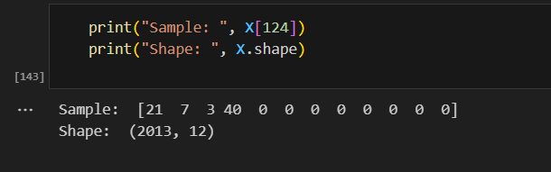
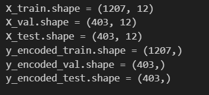
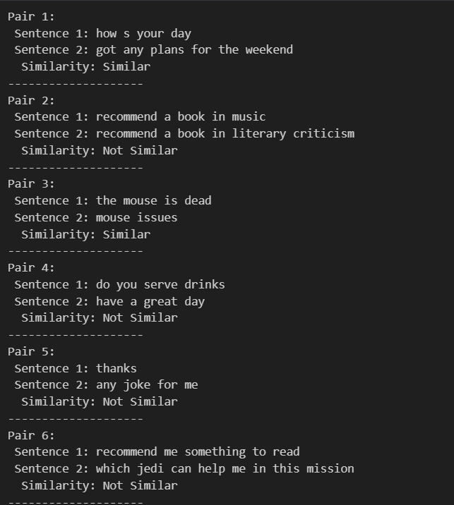
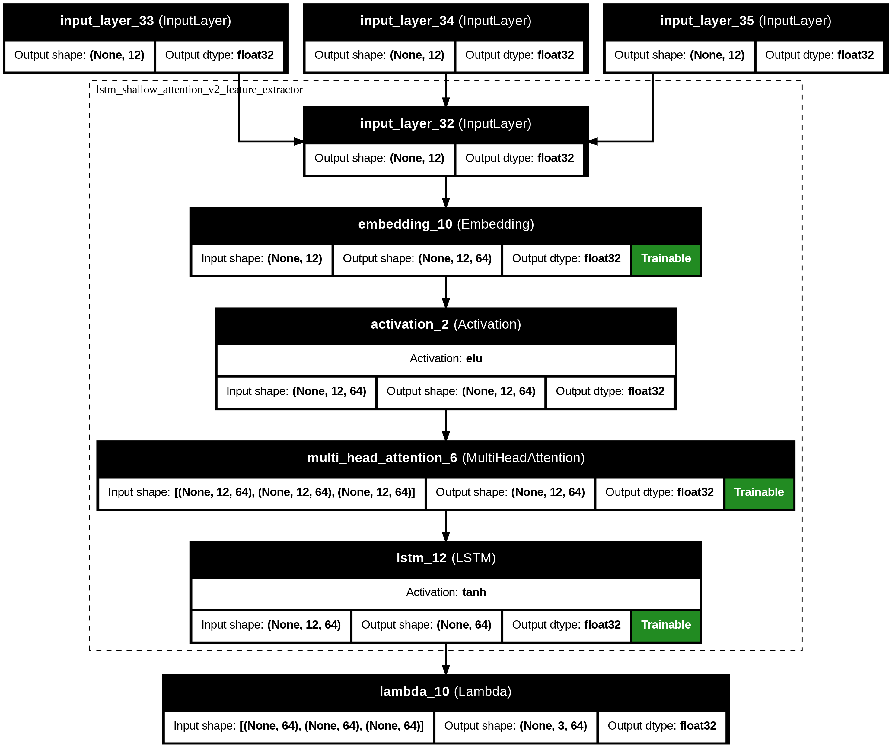
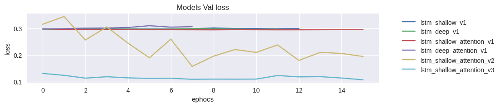

# Chatbot Intent Embedding & Siamese/Triplet Models

## 📌 Project Overview

This project implements a **Chatbot Intent Classification & Embedding System** using **Siamese Networks** and **Triplet Networks**.
The models learn **sentence embeddings** that capture semantic similarity between user queries.
It supports multiple architectures with **LSTMs** and **Attention layers**, and provides a pipeline from **data preprocessing → training → visualization → deployment**.

---

## 🌐 Live Demo (Streamlit App)

We deployed an interactive **Streamlit web app** to test the chatbot intent embeddings in real time.  
You can try it here:  

🔗 [Open the App](https://chatbotquestionansweringsimilaritylearning-wmudhfvxj5fdklehs4g.streamlit.app/)

### ✨ Features
- Enter any **user query**.
- The model extracts its **embedding (latent space)**.
- A **KNN (k=3)** classifier retrieves the most relevant intent tag.
- The system then provides a **suitable response** from the dataset.

📌 Example Flow:
1. Input: `"hey there"`
2. Model → embedding → nearest neighbors
3. Predicted tag: `"greeting"`
4. Output response: `"Hi there! What can I do for you today?"`

---

## 📂 Directory Structure

```
drive/MyDrive/chatbot_answerrr/
│
├── data/                      # Input dataset (JSON intents files)
├── train_cache/               # Cached model weights and history
├── logging/                   # Tokenizer and logs
├── deployments/               # Final tokenizer + exportable models
├── README.md                  # Project documentation
```

---

## 🚀 Steps Taken

### 1. Data Loading

* Mounted Google Drive for persistent storage.
* Loaded dataset from `data/*.json` containing:

  * `tag`: Intent label
  * `patterns`: Input sentences
  * `responses`: Chatbot answers

✅ **Preview of Data**

```python
data_df.head()
```

* 

---

### 2. Data Preprocessing

* Converted all text to lowercase.
* Removed special characters & extra spaces.
* Limited maximum sentence length to **12 words**.
* Removed tags with fewer than 3 samples.
* Removed duplicates and null entries.

📊 **Distribution of Words per Pattern**
* 

📊 **Tag Frequencies**
* 

---

### 3. Tokenization & Label Encoding

* Built a tokenizer using Keras.
* Saved `tokenizer.pkl` for deployment.
* Converted sentences → padded sequences (max length = 12).
* Encoded tags using `LabelEncoder`.

✅ **Sample Encoded Sequence**

```python
print(X[124])   # Example tokenized sentence
```
* 

---

### 4. Dataset Splitting

* Split dataset into:

  * **Train (60%)**
  * **Validation (20%)**
  * **Test (20%)**
* 

---

### 5. Data Generators

Implemented custom Keras `Sequence` generators for:

1. **Siamese Pairs** → anchor-positive & anchor-negative pairs.
2. **Triplets** → anchor, positive, negative.

🔹 With **hard negative mining** (selecting difficult negatives using embeddings).

📌 **Example Generated Pairs**

```
Sentence 1: "hello there"
Sentence 2: "hi"
Similarity: Similar
```
* 

📌 **Example Generated Triplets**

```
Anchor: "book a ticket"
Positive: "reserve a seat"
Negative: "play a song"
```
* 

---

### 6. Model Architectures

We built several **feature extractor networks**:

1. **Shallow LSTM**
2. **Deep LSTM**
3. **Shallow LSTM + Attention**
4. **Deep LSTM + Attention**
5. (Additional variations)

📌 **LSTM with Attention, Triplet Loss**
* 

---

### 7. Training

* Models trained with **Contrastive Loss** or **Triplet Loss**.
* Early stopping + model checkpoints.
* Training history cached in JSON.

📊 **Training vs Validation Loss**
* 
* 


---

### 8. Embedding Visualization

After training, embeddings were extracted from the **feature extractor** and projected into 2D space using **t-SNE**.

📊 **t-SNE Visualization**
* 
* 
* 
* 
* 
* 

📌 Different colors = different intent classes.
This shows clustering quality of sentence embeddings.

---

### 9. Evaluation

* Used **KNN (k=3)** classifier on embeddings.
* Measured **accuracy** and **silhouette score**.

📊 **KNN Accuracy per Model**
* 


---

### 10. Deployment

* Saved trained **feature extractor models** for downstream tasks.
* Stored `tokenizer.pkl` for preprocessing during inference.
* Deployments stored in:

```
deployments/
```

---

## 👨‍💻 Author

Developed by **Youssef Samy**
Machine Learning Engineer | AI Enthusiast